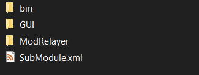

# Installation

In this section we will talk about installation and setup. It's extremely simple and can be done in 3 steps.

!!! Tip "Tip"
    It's highly advised to learn how to install a mod for Bannerlord before starting to read this
    step-by-step guide

### Step 0: Install Mod

Assuming that you already downloaded the mod (you downloaded the mod, right?😄) you should install the mod like any other Bannerlord mod.
If you don't know how to, here is a quick step-by-step information

- Download the mod from nexus.
- Extract mod .zip/.rar file to a folder (Use Winrar, WinZip, 7Zip, up to you)
- Once you extract it, folder called `Inworld` should be like this:

  

- Great. Now go to your game's installation path. It should be similar to `Steam\steamapps\common\Mount & Blade II Bannerlord` but if you are unable to find it and if you are using Steam, open Steam, right click to game, `Properties -> Local Files -> Browse` and it will open the location.

  

- Now copy that `Inworld` folder to `Steam\steamapps\common\Mount & Blade II Bannerlord\Modules\`
- Congrats. It's installed 🚀️

!!! example "Small note"
    If you are getting "Cannot Load" error, [unblock your .dll files](https://steamcommunity.com/app/261550/discussions/0/4233889512148131735/) or simply use [Novus Launcher](https://www.nexusmods.com/mountandblade2bannerlord/mods/4924).

### Step 1: Create Inworld Account

Mod is using Inworld's great AI and TTS system. This means you need one too. But don't worry, it's quite easy to setup an account. It's also very new-user friendly.

Go to  [inworld.com](https://inworld.ai/?utm_campaign=bloctheworker&utm_medium=referral&utm_source=youtube
) And you should be seeing something like this:

Great now click `START CREATING` and it should redirect you to a page similar to this:

Now click to **Sign-up with email** and complete your signup process.
Note that I said `Sign up with email` - don't select the other options because they won't work.

!!! danger "Beware!"
    This part is important. You should select **Sign-up with email** not the other options!

## Step 2: Setting up Workspace

Congrats. You are signed up for Inworld! If you are new user, inworld will redirect you to a shared workspace. Something like this (with different name and more characters)

Now we don't want this workspace, so you should create a new one. For this, Click the `Change` on the left side. This will open a page similar to this

You will probably see only a single workspace in here. So we need to create a new one. Click to `Create new workspace` button and it will redirect you to a page similar to this. Add your workspace name and click `Save` but make sure that you copy your Workspace id to somewhere, we will need that.

When you click to Save it will show a page like this. Congrats! You just created your workspace 🚀️

## Step 3: Connecting Mod to Inworld System

So now you have a mod, you have Inworld account and Inworld Workspace. But they don't know each other. So we need to setup one last thing before we jump into exploring Calradia.

Open your workspace (should be like picture above) and click `Integrations` because this is your first time you won't see anything in this page but it should be similar to this. What you need to do in here is clicking big `Generate new key` button. And this will generate a secret as shown in the image (Dont tell your secret to anyone, it's secret)

Now keep this page open for awhile, we will need that. Go to your mod installation path (`Steam\steamapps\common\Mount & Blade II Bannerlord\Modules\Inworld`) in here you should be seeing a `ModRelayer` folder. Go inside that folder. Inside this folder there should be two things, one of them is a `.env` file and other one is `InworldClient.exe`. We only care about `.env` file for now. Open this file with your text editor (I used notepad, but you can open it with anything you want) It should be similar to this

Now, you need to replace these values.

`LOGIN_EMAIL` is the email you used to sign up for Inworld. Don't forget the put it between `"`

`LOGIN_PASSWORD` is the password you used to sign in for Inworld (Now you see why I asked sign-up with email option 😄)

`INWORLD_KEY` this is the `Key` value in the Integrations page we left open a moment ago. Go there, click to copy-icon to copy that instantly, and replace in here. Again, don't forget to put it in between `"`

`INWORLD_SECRET` is the same as above but use `Secret` value.

`INWORLD_WORKSPACE` is the workspace id of your workspace. If you didn't listen me and didn't take note during creation, check your URL in your browser. It should be similar to this `https://studio.inworld.ai/workspaces/workspaceid22/integrations` in this case the text between `workspaces/` and `/integrations` is your workspace id. Use that one.

`DISABLE_VOICE` is optional setting if you want to disable Text-to-speech in the mod.

!!! danger "Beware!"
    Use `"`. Meaning that it should look like `"yourvalue"` only `DISABLE_VOICE` part is exception.

After all the change, save the file. And you are all clear!

